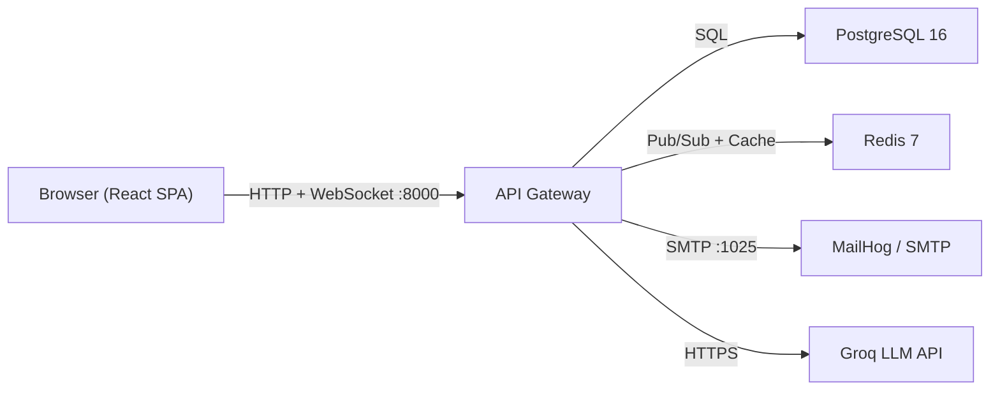
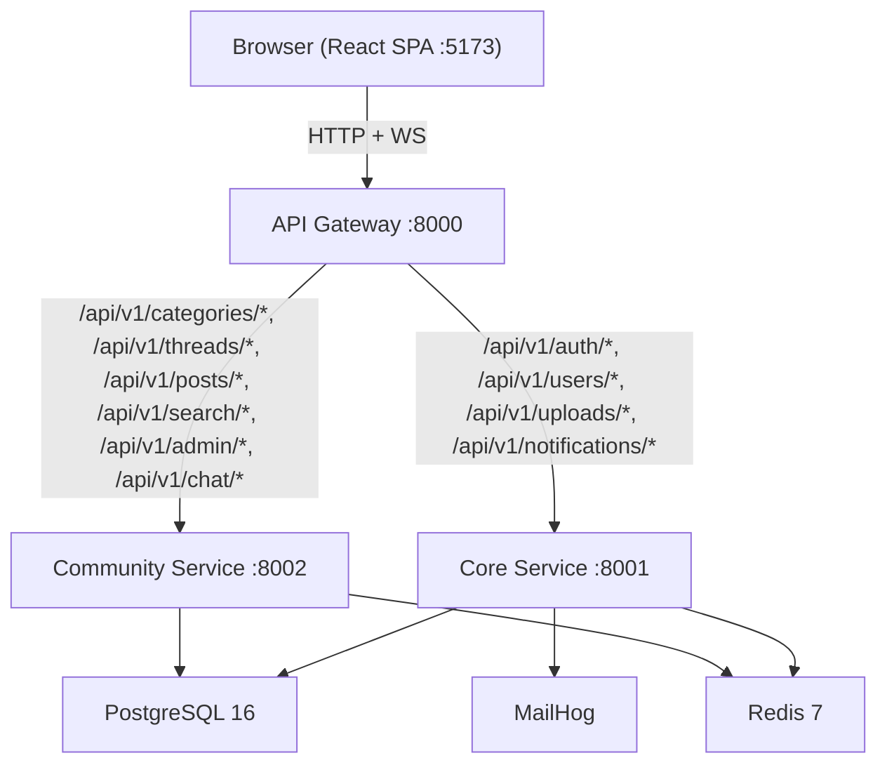

# Architecture Overview

PulseBoard is a real-time discussion forum built with a **FastAPI** microservice backend and a **React** frontend. The system is deployed as **2 backend services** behind an **API gateway** (consolidated from the original 7 services — see [ADR-0001](adr/0001-consolidate-microservices.md)).

---

## System Context

---

## Microservice Architecture

The system is split into **2 backend services** behind an **API gateway** (3 services total). All services share a single PostgreSQL database and communicate via Redis pub/sub.

### Service responsibilities

| Service | Port | Owns |
|---------|------|------|
| **Gateway** | 8000 | Reverse proxy (httpx), CORS, 4 WebSocket endpoints |
| **Core** | 8001 | Registration, login, JWT tokens, OAuth (Google/GitHub), email verification, password reset, profiles, avatars, friend requests, user search, file uploads, in-app notifications, email dispatch |
| **Community** | 8002 | Categories, threads, posts, votes, reactions, tags, search, admin dashboard, user management, reports, mod actions, category requests, chat rooms (group + DM), messages, @pulse bot integration |

### Shared library

All services depend on `pulseboard-shared`, a local pip package at `services/shared/`. It contains:

- All SQLAlchemy models (`shared.models`)
- All Pydantic schemas (`shared.schemas`)
- Configuration (`shared.core.config`)
- Database session factory (`shared.core.database`)
- Auth helpers and JWT utilities (`shared.core.auth_helpers`, `shared.core.security`)
- Redis client (`shared.core.redis`)
- Cross-service utilities (`shared.services.*`): notifications, mentions, attachments, storage, bot, moderation, email

### Gateway routing

The gateway uses an `httpx.AsyncClient` to proxy HTTP requests based on URL prefix:

| Prefix | Target |
|--------|--------|
| `/api/v1/auth` | `http://core:8001` |
| `/api/v1/users` | `http://core:8001` |
| `/api/v1/uploads` | `http://core:8001` |
| `/api/v1/notifications` | `http://core:8001` |
| `/api/v1/categories` | `http://community:8002` |
| `/api/v1/threads` | `http://community:8002` |
| `/api/v1/posts` | `http://community:8002` |
| `/api/v1/search` | `http://community:8002` |
| `/api/v1/admin` | `http://community:8002` |
| `/api/v1/chat` | `http://community:8002` |

WebSocket endpoints (`/ws/notifications`, `/ws/threads/{thread_id}`, `/ws/chat/{room_id}`, `/ws/global`) are handled directly by the gateway, not proxied.

---

## Real-Time Strategy

- **REST** handles all CRUD, auth, uploads, and admin workflows.
- **WebSockets** handle live updates across four channels:

| Endpoint | Purpose | Auth |
|----------|---------|------|
| `/ws/notifications` | Per-user notification push | JWT token required |
| `/ws/threads/{thread_id}` | New posts, vote/reaction updates for a thread | Public |
| `/ws/chat/{room_id}` | Real-time chat messages | JWT token required |
| `/ws/global` | App-wide events (e.g. new category created) | Public |

- **Redis pub/sub** broadcasts events across WebSocket connection managers, supporting future multi-instance scaling.

---

## Technology Stack

| Layer | Technology |
|-------|------------|
| Frontend | React 18, Vite 6, React Router DOM 6, Axios, plain CSS |
| Backend | Python 3.12, FastAPI, SQLAlchemy 2 (ORM), Pydantic v2, Uvicorn |
| Database | PostgreSQL 16 (Alpine) |
| Cache / Pub-Sub | Redis 7 (Alpine) |
| Auth | JWT (python-jose), OAuth2 (Google + GitHub), passlib (pbkdf2_sha256) |
| Email | smtplib with MailHog in dev |
| AI Bot | Groq Compound Mini (built-in web search) + Tavily search for @pulse mentions |
| Containerization | Docker, Docker Compose |
