# Database Design

PulseBoard uses **PostgreSQL 16** with **SQLAlchemy 2** ORM models. The schema contains **23 tables**. All tables inherit a `TimestampMixin` (`created_at`, `updated_at`) except `thread_subscriptions` and `thread_tags`.

---

## Entity-Relationship Diagram

```mermaid
erDiagram
    users {
        int id PK
        string email UK
        string username UK
        string password_hash "nullable"
        enum role "admin | moderator | member"
        text bio "nullable"
        string avatar_url "nullable"
        bool is_verified
        bool is_active
        bool is_suspended
        datetime suspended_until "nullable"
        bool is_banned
        datetime created_at
        datetime updated_at
    }

    refresh_tokens {
        int id PK
        int user_id FK
        string token_id UK
        datetime expires_at
        datetime revoked_at "nullable"
    }

    email_verification_tokens {
        int id PK
        int user_id FK
        string token UK
        datetime expires_at
        datetime used_at "nullable"
    }

    password_reset_tokens {
        int id PK
        int user_id FK
        string token UK
        datetime expires_at
        datetime used_at "nullable"
    }

    oauth_accounts {
        int id PK
        int user_id FK
        string provider
        string provider_user_id
        string provider_email "nullable"
    }

    friend_requests {
        int id PK
        int requester_id FK
        int recipient_id FK
        enum status "pending | accepted | declined"
        datetime responded_at "nullable"
    }

    categories {
        int id PK
        string title UK
        string slug UK
        text description "nullable"
    }

    threads {
        int id PK
        int category_id FK
        int author_id FK
        string title
        text body
        bool is_locked
        bool is_pinned
    }

    thread_subscriptions {
        int id PK
        int thread_id FK
        int user_id FK
    }

    posts {
        int id PK
        int thread_id FK
        int author_id FK
        int parent_post_id FK "nullable, self-ref"
        text body
    }

    tags {
        int id PK
        string name UK
    }

    thread_tags {
        int id PK
        int thread_id FK
        int tag_id FK
    }

    votes {
        int id PK
        int user_id FK
        string entity_type "thread | post"
        int entity_id "polymorphic"
        smallint value
    }

    reactions {
        int id PK
        int user_id FK
        string entity_type "thread | post"
        int entity_id "polymorphic"
        string emoji
    }

    content_reports {
        int id PK
        int reporter_id FK
        string entity_type "thread | post"
        int entity_id "polymorphic"
        text reason
        string status "pending | resolved | dismissed"
        int resolved_by FK "nullable"
        datetime resolved_at "nullable"
    }

    moderation_actions {
        int id PK
        int moderator_id FK
        int target_user_id FK
        string action_type "warn | suspend | ban"
        text reason
        int duration_hours "nullable"
        int report_id FK "nullable"
    }

    category_moderators {
        int id PK
        int user_id FK
        int category_id FK
    }

    category_requests {
        int id PK
        int requester_id FK
        string title
        string slug
        text description
        string status "pending | approved | rejected"
        int reviewed_by FK "nullable"
        datetime reviewed_at "nullable"
    }

    chat_rooms {
        int id PK
        string name
        string room_type "direct | group"
        int created_by_id FK
    }

    chat_room_members {
        int id PK
        int room_id FK
        int user_id FK
    }

    messages {
        int id PK
        int room_id FK
        int sender_id FK
        text body
        int reply_to_message_id FK "nullable, self-ref"
    }

    notifications {
        int id PK
        int user_id FK
        string notification_type
        string title
        json payload
        bool is_read
    }

    attachments {
        int id PK
        int uploader_id FK
        string linked_entity_type "polymorphic"
        int linked_entity_id "polymorphic"
        string file_name
        string file_type
        int file_size
        string storage_path
    }

    users ||--o{ refresh_tokens : "has"
    users ||--o{ email_verification_tokens : "has"
    users ||--o{ password_reset_tokens : "has"
    users ||--o{ oauth_accounts : "has"
    users ||--o{ friend_requests : "requester"
    users ||--o{ friend_requests : "recipient"
    users ||--o{ threads : "authors"
    users ||--o{ posts : "authors"
    users ||--o{ votes : "casts"
    users ||--o{ reactions : "casts"
    users ||--o{ content_reports : "reports"
    users ||--o{ moderation_actions : "moderator"
    users ||--o{ moderation_actions : "target"
    users ||--o{ category_moderators : "assigned"
    users ||--o{ category_requests : "requests"
    users ||--o{ chat_rooms : "creates"
    users ||--o{ chat_room_members : "joins"
    users ||--o{ messages : "sends"
    users ||--o{ notifications : "receives"
    users ||--o{ attachments : "uploads"
    users ||--o{ thread_subscriptions : "subscribes"

    categories ||--o{ threads : "contains"
    categories ||--o{ category_moderators : "has"

    threads ||--o{ posts : "contains"
    threads ||--o{ thread_subscriptions : "has"
    threads }o--o{ tags : "thread_tags"

    posts ||--o{ posts : "parent_post_id (nested replies)"

    chat_rooms ||--o{ chat_room_members : "has"
    chat_rooms ||--o{ messages : "contains"

    messages ||--o{ messages : "reply_to_message_id"

    content_reports ||--o{ moderation_actions : "linked via report_id"
```

---

## Table Summary

| # | Table | Rows Reference | Timestamps | Notes |
|---|-------|---------------|------------|-------|
| 1 | `users` | Central entity | Yes | 13+ tables reference `users.id` |
| 2 | `refresh_tokens` | `users` | Yes | JWT refresh token tracking |
| 3 | `email_verification_tokens` | `users` | Yes | One-time email verification |
| 4 | `password_reset_tokens` | `users` | Yes | One-time password reset |
| 5 | `oauth_accounts` | `users` | Yes | Google/GitHub OAuth linkage |
| 6 | `friend_requests` | `users` x2 | Yes | Unique on `(requester_id, recipient_id)` |
| 7 | `categories` | -- | Yes | Forum communities |
| 8 | `threads` | `categories`, `users` | Yes | Forum threads |
| 9 | `thread_subscriptions` | `threads`, `users` | **No** | Notification opt-in |
| 10 | `posts` | `threads`, `users`, self | Yes | Self-referential via `parent_post_id` |
| 11 | `tags` | -- | Yes | Unique tag names |
| 12 | `thread_tags` | `threads`, `tags` | **No** | Many-to-many junction |
| 13 | `votes` | `users` (polymorphic) | Yes | `entity_type` + `entity_id` -> thread/post |
| 14 | `reactions` | `users` (polymorphic) | Yes | `entity_type` + `entity_id` + `emoji` |
| 15 | `content_reports` | `users` x2 (polymorphic) | Yes | Reporter + resolver |
| 16 | `moderation_actions` | `users` x2, `content_reports` | Yes | warn/suspend/ban log |
| 17 | `category_moderators` | `users`, `categories` | Yes | Category-scoped mod assignment |
| 18 | `category_requests` | `users` x2 | Yes | Mod requests new category |
| 19 | `chat_rooms` | `users` | Yes | Direct + group rooms |
| 20 | `chat_room_members` | `chat_rooms`, `users` | Yes | Room membership |
| 21 | `messages` | `chat_rooms`, `users`, self | Yes | Self-referential via `reply_to_message_id` |
| 22 | `notifications` | `users` | Yes | JSON payload for flexible data |
| 23 | `attachments` | `users` (polymorphic) | Yes | `linked_entity_type` + `linked_entity_id` |

---

## Polymorphic FK Pattern

Four tables use a **discriminator + generic ID** pattern instead of formal foreign keys on the entity ID column:

| Table | Discriminator | ID Column | Known Values |
|-------|--------------|-----------|--------------|
| `votes` | `entity_type` | `entity_id` | `"thread"`, `"post"` |
| `reactions` | `entity_type` | `entity_id` | `"thread"`, `"post"` |
| `content_reports` | `entity_type` | `entity_id` | `"thread"`, `"post"` |
| `attachments` | `linked_entity_type` | `linked_entity_id` | `"thread"`, `"post"`, `"message"`, etc. |

This pattern enables a single table to associate with multiple entity types without requiring a foreign key per type. Referential integrity is enforced at the application level.

---

## Unique Constraints

| Table | Columns | Name |
|-------|---------|------|
| `users` | `(email)` | column-level |
| `users` | `(username)` | column-level |
| `refresh_tokens` | `(token_id)` | column-level |
| `email_verification_tokens` | `(token)` | column-level |
| `password_reset_tokens` | `(token)` | column-level |
| `friend_requests` | `(requester_id, recipient_id)` | `uq_friend_request_pair` |
| `categories` | `(title)` | column-level |
| `categories` | `(slug)` | column-level |
| `tags` | `(name)` | column-level |
| `thread_tags` | `(thread_id, tag_id)` | `uq_thread_tag` |
| `thread_subscriptions` | `(thread_id, user_id)` | `uq_thread_subscription` |
| `votes` | `(user_id, entity_type, entity_id)` | `uq_vote_user_entity` |
| `reactions` | `(user_id, entity_type, entity_id, emoji)` | `uq_reaction_user_entity_emoji` |
| `content_reports` | `(reporter_id, entity_type, entity_id)` | `uq_report_user_entity` |
| `category_moderators` | `(user_id, category_id)` | `uq_category_moderator` |
| `chat_room_members` | `(room_id, user_id)` | `uq_chat_room_user` |

---

## Enums

| Enum | Values | Used By |
|------|--------|---------|
| `UserRole` | `admin`, `moderator`, `member` | `users.role` |
| `FriendRequestStatus` | `pending`, `accepted`, `declined` | `friend_requests.status` |

String-based de facto enums (not SQLAlchemy Enum types):

| Column | Table(s) | Values |
|--------|----------|--------|
| `entity_type` | `votes`, `reactions`, `content_reports` | `"thread"`, `"post"` |
| `linked_entity_type` | `attachments` | `"thread"`, `"post"`, `"message"`, etc. |
| `status` | `content_reports` | `"pending"`, `"resolved"`, `"dismissed"` |
| `action_type` | `moderation_actions` | `"warn"`, `"suspend"`, `"ban"` |
| `status` | `category_requests` | `"pending"`, `"approved"`, `"rejected"` |
| `room_type` | `chat_rooms` | `"direct"`, `"group"` |

---

## Migration Strategy

PulseBoard does **not** use Alembic. Schema management uses:

1. `Base.metadata.create_all(engine)` for initial table creation.
2. `_run_migrations()` in `database.py` with raw SQL `ALTER TABLE ... ADD COLUMN IF NOT EXISTS` statements for incremental changes.
