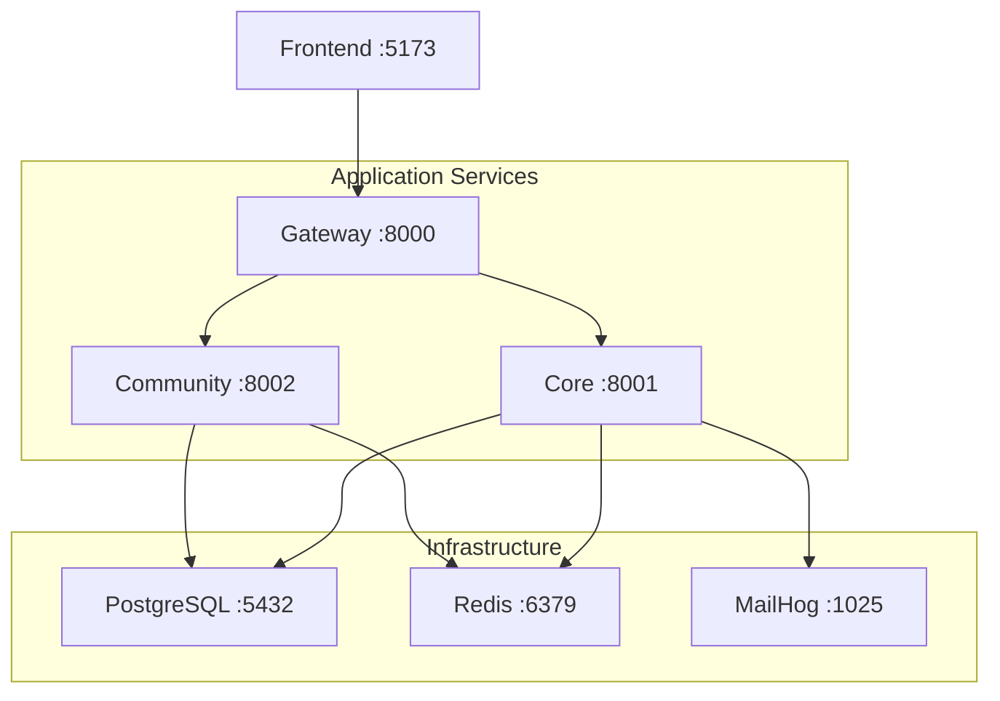

# Deployment

PulseBoard uses a distributed **microservice** topology deployed with Docker Compose. The architecture consists of 2 backend services behind an API gateway (consolidated from the original 7 services).

---

## Deployment

```
docker compose up --build
```

Uses `docker-compose.yml`.



### Services

| Service | Dockerfile | Port | Volumes | Depends On |
|---------|-----------|------|---------|------------|
| `gateway` | `services/gateway/Dockerfile` | 8000 | gateway code, shared lib, `upload_data` | core, community |
| `core` | `services/core/Dockerfile` | 8001 | core code, shared lib, `upload_data` | db (healthy), redis (healthy), mailhog (started) |
| `community` | `services/community/Dockerfile` | 8002 | community code, shared lib, `upload_data` | db (healthy), redis (healthy) |
| `frontend` | `./frontend` | 5173 | frontend code | gateway |
| `db` | `postgres:16-alpine` | 5432 | `postgres_data` | -- |
| `redis` | `redis:7-alpine` | 6379 | `redis_data` | -- |
| `mailhog` | `mailhog/mailhog:latest` | 1025, 8025 | -- | -- |

### Health checks

Infrastructure services (`db`, `redis`) have health checks. Application services wait for `condition: service_healthy` on db and redis before starting.

### Shared volumes

- `postgres_data` -- persistent database storage
- `redis_data` -- persistent Redis storage
- `upload_data` -- shared between gateway, core, and community services for file uploads

---

## Environment Variables

All services read from the root `.env` file via `env_file: .env`. Key variable categories:

| Category | Variables |
|----------|----------|
| **Application** | `PROJECT_NAME`, `ENVIRONMENT`, `GATEWAY_PORT`, `FRONTEND_URL`, `API_V1_PREFIX`, `SEED_DEFAULT_CATEGORIES_ON_STARTUP` |
| **Database** | `POSTGRES_SERVER`, `POSTGRES_PORT`, `POSTGRES_DB`, `POSTGRES_USER`, `POSTGRES_PASSWORD`, `DATABASE_URL_OVERRIDE` |
| **Redis** | `REDIS_URL` |
| **Security** | `SECRET_KEY`, `ALGORITHM`, `ACCESS_TOKEN_EXPIRE_MINUTES`, `REFRESH_TOKEN_EXPIRE_DAYS` |
| **OAuth** | `GOOGLE_CLIENT_ID`, `GOOGLE_CLIENT_SECRET`, `GITHUB_CLIENT_ID`, `GITHUB_CLIENT_SECRET`, `OAUTH_REDIRECT_BASE`, `OAUTH_FRONTEND_SUCCESS_URL` |
| **Email** | `MAIL_FROM`, `MAIL_SERVER`, `MAIL_PORT` |
| **Uploads** | `UPLOAD_DIR`, `MAX_UPLOAD_SIZE_MB` |
| **AI Bot** | `GROQ_API_KEY`, `GROQ_MODEL`, `GROQ_API_URL`, `TAVILY_API_KEY` |
| **Services** | `CORE_SERVICE_URL`, `COMMUNITY_SERVICE_URL` |

---

## Database Initialization

PulseBoard does **not** use Alembic. On startup each service runs:

1. `Base.metadata.create_all(engine)` -- creates tables that don't exist yet.
2. `_run_migrations()` -- raw SQL `ALTER TABLE ... ADD COLUMN IF NOT EXISTS` for incremental schema changes.

The community service has `SEED_DEFAULT_CATEGORIES_ON_STARTUP=true` in the Docker Compose file to seed initial categories.

---

## Production Considerations

| Concern | Recommendation |
|---------|---------------|
| **Database** | Managed PostgreSQL (e.g., Render, AWS RDS, Supabase) |
| **Redis** | Managed Redis (e.g., Upstash, Render Redis) |
| **File storage** | Replace local `upload_data` volume with S3-compatible object storage |
| **Email** | Replace MailHog with a real SMTP service (e.g., SendGrid, AWS SES) |
| **Frontend hosting** | Deploy to Vercel with `VITE_API_BASE_URL` pointing to the API gateway |
| **Backend hosting** | Deploy services to Render, Railway, or container orchestration (Kubernetes) |
| **CORS** | Set `FRONTEND_URL` to the production frontend domain |
| **Secrets** | Set `SECRET_KEY` to a strong random value; configure OAuth client credentials for production redirect URIs |
| **WebSocket** | Ensure the hosting platform supports long-lived WebSocket connections |
| **HTTPS** | Terminate TLS at the load balancer / reverse proxy level |

---

## Release Checklist

1. Set all environment variables (see table above) for the production environment
2. Ensure `SECRET_KEY` is a strong random value (not `change-me`)
3. Configure OAuth redirect URIs in Google/GitHub developer consoles to match production URLs
4. Set `OAUTH_REDIRECT_BASE` to the backend's public URL
5. Set `OAUTH_FRONTEND_SUCCESS_URL` to the frontend's login page URL
6. Replace local upload volume with object storage integration
7. Replace MailHog with a production SMTP service
8. Verify database tables are created on first startup
9. Confirm WebSocket connectivity through the production infrastructure
