# Flow Diagrams

Mermaid sequence diagrams for PulseBoard's core workflows.

---

## 1. Registration and Email Verification

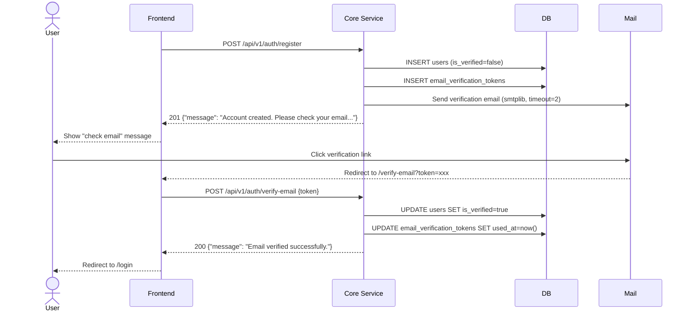

---

## 2. Login and Token Refresh

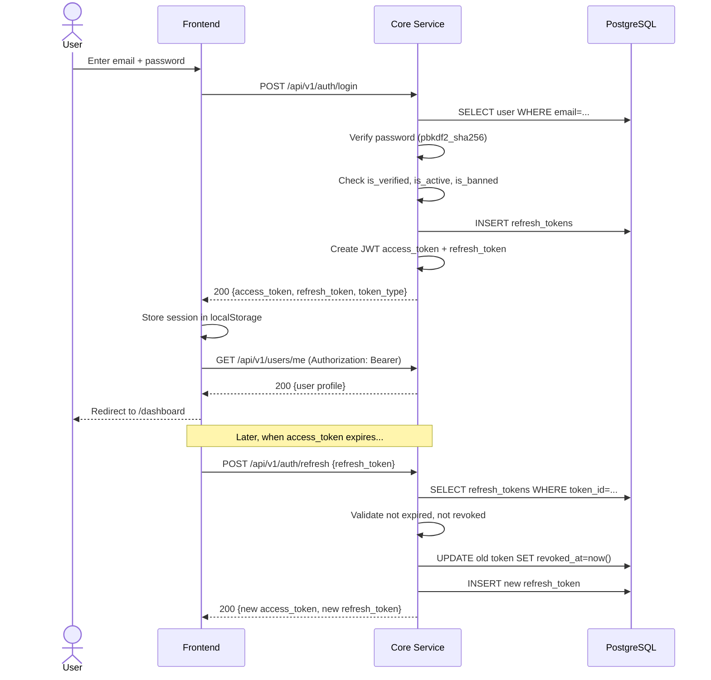

---

## 3. OAuth Flow (Google / GitHub)

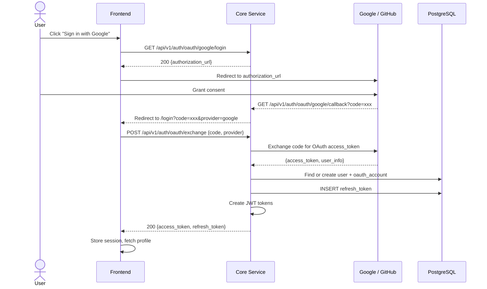

---

## 4. Thread Creation with Real-Time Updates

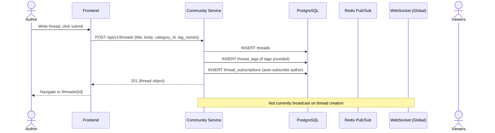

---

## 5. Post/Reply with Live Thread Updates

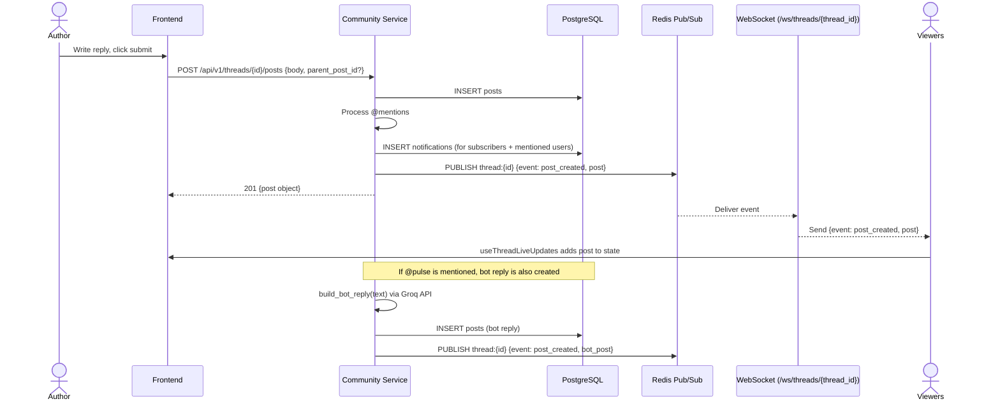

---

## 6. Chat Message Flow

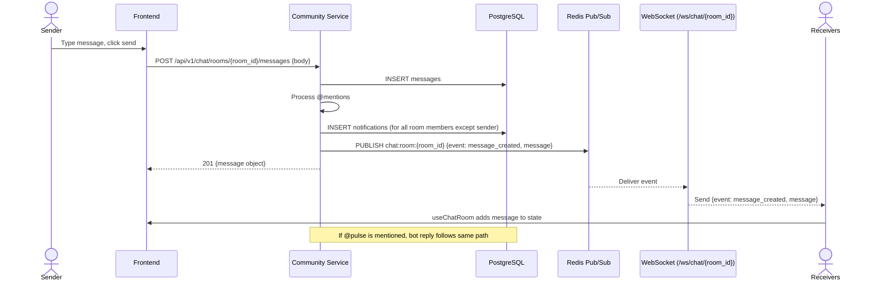

---

## 7. Notification Delivery

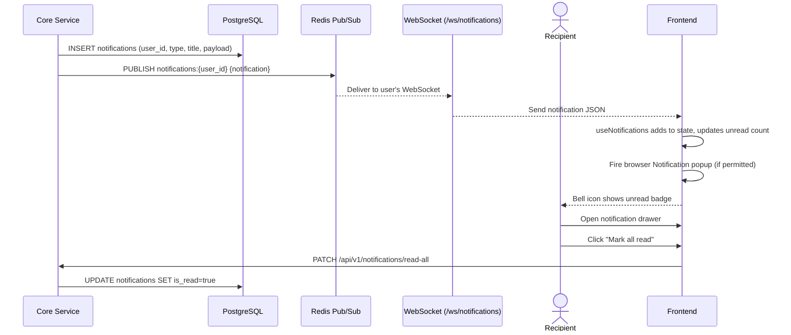

---

## 8. Moderation Workflow

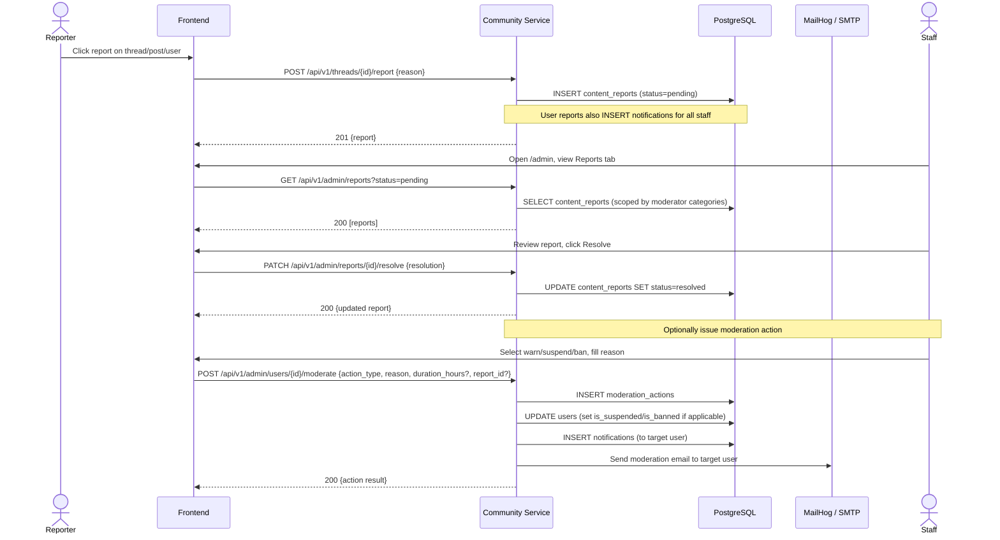

---

## 9. Category Request and Approval

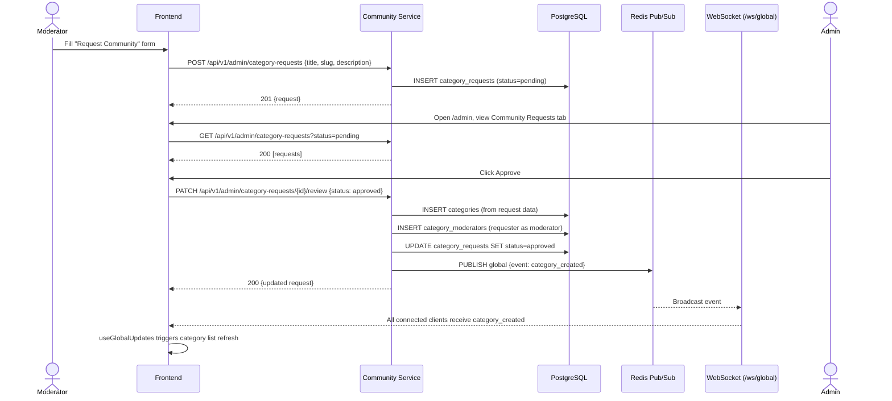

---

## 10. WebSocket Connection Lifecycle

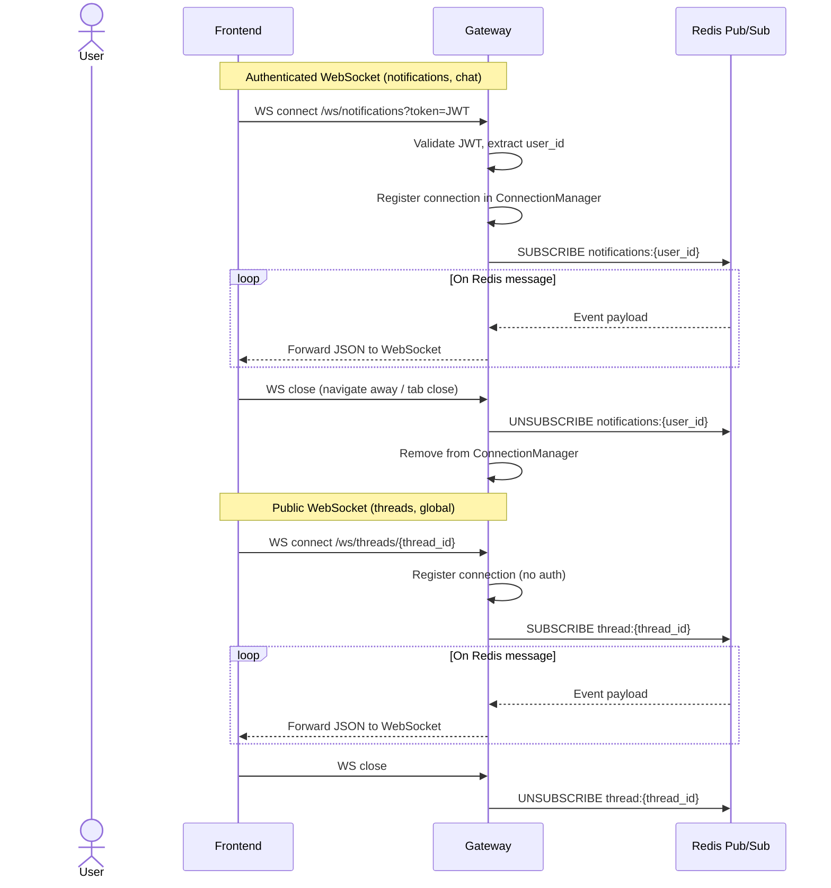

---

## 11. Password Reset Flow

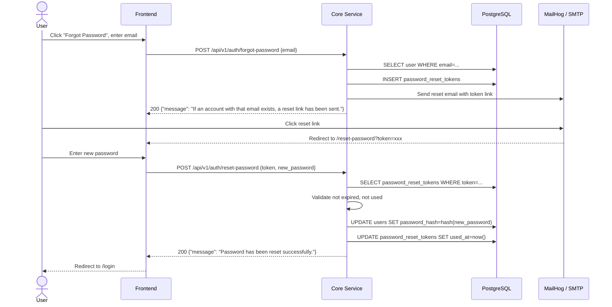
