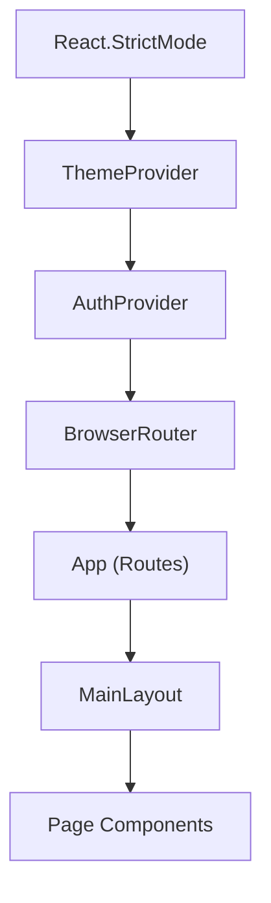
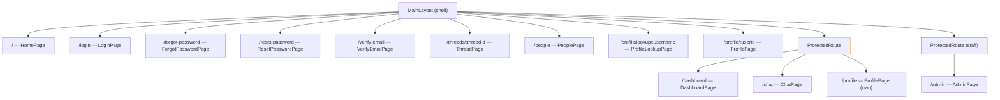
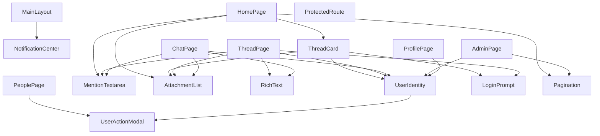

# Frontend Architecture

PulseBoard's frontend is a **React 18** single-page application built with **Vite 6**, using plain CSS and React Router DOM v6. It communicates with the API gateway at `http://localhost:8000`.

---

## Provider Hierarchy

Entry point: `main.jsx` wraps the entire app in `StrictMode -> ThemeProvider -> AuthProvider -> BrowserRouter -> App`.

---

## Route Tree

| Route | Page | Access | Description |
|-------|------|--------|-------------|
| `/` | HomePage | Public | Community feed with filtering, search, thread composer |
| `/login` | LoginPage | Public | Login/register with OAuth (Google, GitHub) |
| `/forgot-password` | ForgotPasswordPage | Public | Request password reset email |
| `/reset-password` | ResetPasswordPage | Public | Set new password via token |
| `/verify-email` | VerifyEmailPage | Public | Email verification via token |
| `/threads/:threadId` | ThreadPage | Public | Full thread with nested replies, voting, reactions |
| `/people` | PeoplePage | Public | User search and discovery |
| `/profile/lookup/:username` | ProfileLookupPage | Public | Resolves username to user ID, redirects to profile |
| `/profile/:userId` | ProfilePage | Public | View another user's profile |
| `/dashboard` | DashboardPage | Auth required | Personal stats, recent activity, friends |
| `/chat` | ChatPage | Auth required | Real-time chat rooms (group + DM) |
| `/profile` | ProfilePage | Auth required | Edit own profile, manage friends |
| `/admin` | AdminPage | Staff only | Admin/moderation dashboard |

---

## Component Dependency Graph

---

## Components

| Component | Purpose | Used By |
|-----------|---------|---------|
| `ProtectedRoute` | Route guard; redirects to `/login` if unauthenticated; supports `requiredRole="staff"` | App.jsx |
| `MainLayout` | App shell with top navbar, horizontal nav row, notification bell, theme toggle | All pages |
| `ThreadCard` | Thread summary card with votes, reactions, tags, report, login prompt for guests | HomePage |
| `MentionTextarea` | Textarea with `@mention` autocomplete (debounced user search) | HomePage, ThreadPage, ChatPage |
| `NotificationCenter` | Slide-out notification drawer with merge, filter, type icons | MainLayout |
| `RichText` | Renders text with clickable `@username` links | ThreadPage, ChatPage |
| `AttachmentList` | Renders file attachments (image previews, download links) | HomePage, ThreadPage, ChatPage, ThreadCard |
| `UserActionModal` | Modal with message/friend/report actions for a user | PeoplePage, UserIdentity |
| `UserIdentity` | User display (avatar, username, role) with click-to-open modal; auto-assigns Pulse bot avatar | ThreadPage, ChatPage, ProfilePage, AdminPage, ThreadCard |
| `LoginPrompt` | Inline banner prompting unauthenticated users to log in for protected actions | ThreadCard, ThreadPage |
| `Pagination` | Numbered page buttons with ellipsis, Prev/Next, total count | HomePage, AdminPage |

---

## Hooks

| Hook | Purpose | WebSocket | Used By |
|------|---------|-----------|---------|
| `useLocalStorage` | Persistent state in localStorage | -- | AuthContext, ThemeContext, MainLayout |
| `useNotifications` | Load + real-time notifications, mark-read, browser popups | `/ws/notifications` | MainLayout |
| `useChatRoom` | Load message history + real-time chat messages | `/ws/chat/{roomId}` | ChatPage |
| `useThreadLiveUpdates` | Real-time thread events (post_created, vote_updated, reaction_updated) | `/ws/threads/{threadId}` | ThreadPage |
| `useGlobalUpdates` | App-wide events (category_created) | `/ws/global` | MainLayout, HomePage, AdminPage |

---

## Contexts

### AuthContext

- **State**: `session` (JWT tokens, persisted to localStorage), `profile` (user object), `isLoadingProfile`
- **Derived**: `isAuthenticated`
- **Methods**: `setSession(data)`, `setProfile(data)`, `refreshProfile()`, `logout()`
- **API**: `GET /api/v1/users/me` on session change
- **Hook**: `useAuth()`

### ThemeContext

- **State**: `theme` (`"dark"` | `"light"`, persisted to localStorage)
- **Derived**: `isDark`
- **Methods**: `toggleTheme()`, `setTheme(value)`
- **Rendering**: Wraps children in `
` for CSS variable switching
- **Hook**: `useTheme()`

---

## API Utility (`lib/api.js`)

| Export | Purpose |
|--------|---------|
| `API_BASE_URL` | `http://localhost:8000/api/v1` |
| `getHeaders(token, extraHeaders)` | Builds headers with `Content-Type` and optional `Authorization: Bearer` |
| `apiRequest(path, options)` | Core fetch wrapper; prepends base URL, parses errors, handles 204 |

All pages call `apiRequest()` inline — there are no named API functions (e.g., no `createThread()` wrapper). File uploads use raw `fetch()` directly to avoid the JSON content-type header.

---

## Page-to-API Mapping

| Page | API Endpoints Used |
|------|-------------------|
| **HomePage** | `GET /categories`, `GET /threads`, `GET /search`, `POST /threads`, `POST /uploads` |
| **LoginPage** | `POST /auth/login`, `POST /auth/register`, `POST /auth/oauth/exchange`, `GET /auth/oauth/{provider}/login` |
| **ThreadPage** | `GET /threads/{id}`, `POST /threads/{id}/posts`, `POST /threads/{id}/subscribe`, `PATCH /threads/{id}`, `DELETE /threads/{id}`, `POST /threads/{id}/vote`, `GET /threads/{id}/voters`, `POST /threads/{id}/react`, `POST /threads/{id}/report`, `POST /posts/{id}/vote`, `GET /posts/{id}/voters`, `POST /posts/{id}/react`, `POST /posts/{id}/report`, `PATCH /posts/{id}`, `DELETE /posts/{id}`, `POST /uploads` |
| **AdminPage** | `GET /admin/summary`, `GET /admin/threads`, `GET /admin/users`, `GET /admin/reports`, `GET /admin/category-requests`, `GET /categories`, `PATCH /admin/users/{id}/suspend`, `PATCH /admin/users/{id}/unsuspend`, `PATCH /admin/users/{id}/ban`, `PATCH /admin/users/{id}/unban`, `PATCH /admin/users/{id}/role`, `POST /admin/users/{id}/moderate`, `POST /admin/category-moderators`, `DELETE /admin/category-moderators`, `GET /admin/category-moderators/{id}`, `POST /categories`, `POST /admin/category-requests`, `PATCH /admin/reports/{id}/resolve`, `PATCH /admin/category-requests/{id}/review`, `PATCH /admin/threads/{id}/lock`, `PATCH /admin/threads/{id}/unlock`, `PATCH /admin/threads/{id}/pin`, `PATCH /admin/threads/{id}/unpin` |
| **DashboardPage** | `GET /threads`, `GET /users/friends`, `GET /notifications` |
| **ProfilePage** | `PATCH /users/me`, `POST /users/me/avatar`, `GET /users/{id}`, `GET /users/friends`, `POST /users/friends/{id}/accept`, `POST /users/friends/{id}/decline` |
| **ProfileLookupPage** | `GET /users/lookup/{username}` |
| **ChatPage** | `GET /chat/rooms`, `GET /users`, `POST /chat/rooms`, `POST /chat/direct/{username}`, `POST /chat/rooms/{id}/messages`, `POST /chat/rooms/{id}/members`, `GET /chat/rooms/{id}`, `GET /chat/rooms/{id}/messages`, `POST /uploads` |
| **PeoplePage** | `GET /users/search` |
| **ForgotPasswordPage** | `POST /auth/forgot-password` |
| **ResetPasswordPage** | `POST /auth/reset-password` |
| **VerifyEmailPage** | `POST /auth/verify-email` |

---

## Styling

- Single global stylesheet: `styles/global.css` (~3,270 lines)
- Reddit-inspired design: `#FF4500` orange-red accent, `#030303` dark background, `#1a1a1b` card background
- CSS custom properties for theming via `[data-theme="dark"]` / `[data-theme="light"]`
- System fonts (`-apple-system, BlinkMacSystemFont, 'Segoe UI', Roboto`) — no Google Fonts
- No CSS modules, no Tailwind, no styled-components
- Custom SVG logo (`public/logo.svg`) — shield with pulse line, used as navbar brand and favicon
- Pulse bot avatar (`public/pulse-avatar.svg`) — orange robot head, auto-assigned for `pulse` username
